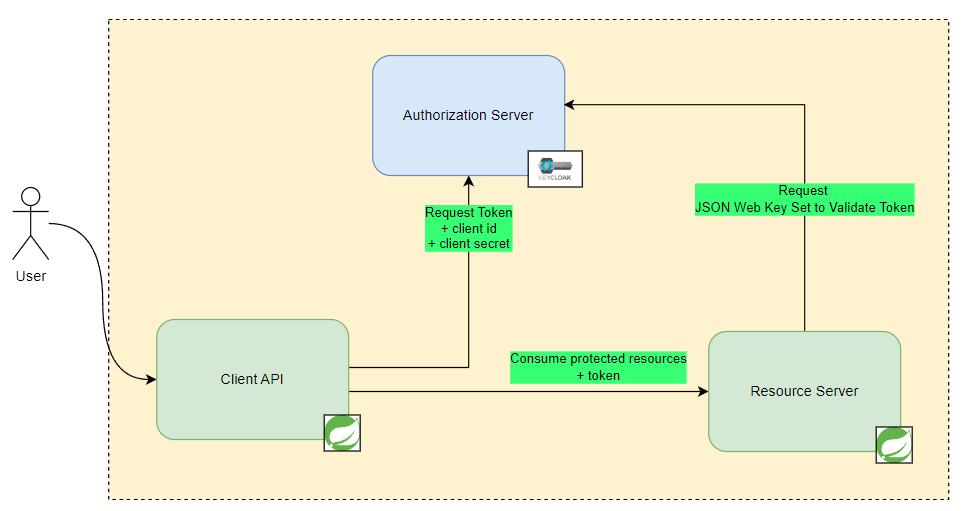

<h1 align="center"> A proof of concept about private backend communication with Keycloak as an Authorization Server </h1>

## :scroll: About this project

This project was built as a way to study Keycloak as an authorization server and the possibilities of using it with a Java Spring Rest APIs.


## :gear: Technologies

- `Keycloak 19.0.1`
- `Java 11`
- `Mysql 8.1`
- `Spring Boot 2.7.0`
- `Docker`

## Architecture



## :computer: How to run

### 1) Compile the applications:

```bash
docker compose build
```

### 2) Run keycloak, client API and resource server API:

```bash
docker compose up
```

After step 2, you can check keycloak's configurations accessing the administration console on http://localhost:8080/. Keycloak takes a while to setup and is available when you see the message "running server in development mode..."

- Login: `admin`
- Password: `admin`

For this PoC i've created a realm called *"Spring"* where i could test and setup OAuth2 grant flows (client_credentials & authorization code)

Both Springboot applications are simple Rest APIs. I just wanted to see how difficult it would be to use spring security's oauth2 client and resource server libs with it.


### 3) Request the protected resources and see the server return unauthorized

```bash
curl --location --request GET 'http://localhost:8090/app/v1/resources' 
```

The resource server available on port 8090 is represented by the client named *"spring-app"* which is owner of the service account role *"spring-app-consumer"*

### 4) Request the client API and receive the private content from the resource server

```bash
curl --location --request GET 'http://localhost:8091/client/api/resources'
```

The client api available on port 8091 is public and only acts as a proxy of the private resource server. The application asks keycloak for an `access_token` using its client that has the required service role. As a result one token is emitted by our authorization server and passed thru the 'Authorization' header when the communication happens.

To check if the token is valid and has the right audience, the resource server access Keycloak's OpenId /certs endpoint and get the JWKS required for such validation.
